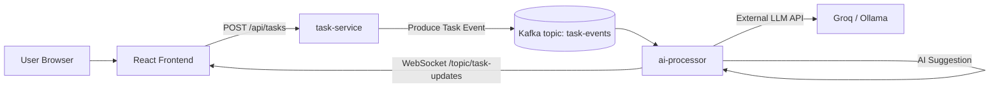
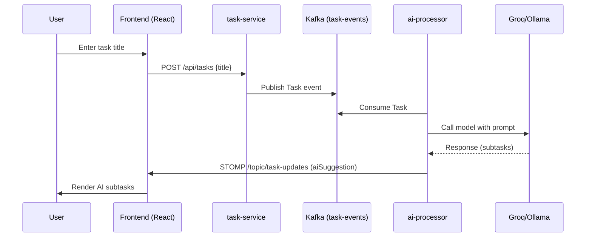

# Task Generator AI (Kafka + Spring Boot + React)

AI-assisted task breakdown application using:
- Spring Boot microservices (`task-service`, `ai-processor`)
- Apache Kafka for event streaming
- WebSocket (STOMP) for real-time AI suggestion updates
- React frontend
- Optional Groq / LLM backend integration

---

## Architecture



### Sequence



---

## Components

| Layer | Description |
|-------|-------------|
| Task Producer | [`com.example.task_service.controller.TaskController`](backend/task-service/src/main/java/com/example/task_service/controller/TaskController.java) |
| Kafka Producer | [`com.example.task_service.config.KafkaProducerConfig`](backend/task-service/src/main/java/com/example/task_service/config/KafkaProducerConfig.java) |
| Kafka Topic | [`com.example.task_service.config.KafkaConfig`](backend/task-service/src/main/java/com/example/task_service/config/KafkaConfig.java) |
| AI Consumer | [`com.example.ai_processor.config.KafkaConsumerConfig`](backend/ai-processor/src/main/java/com/example/ai_processor/config/KafkaConsumerConfig.java) |
| AI Processing Service | [`com.example.ai_processor.service.AiProcessorService`](backend/ai-processor/src/main/java/com/example/ai_processor/service/AiProcessorService.java) |
| WebSocket Broker | [`com.example.ai_processor.config.WebSocketConfig`](backend/ai-processor/src/main/java/com/example/ai_processor/config/WebSocketConfig.java) |
| Shared Model | [`com.example.task_service.model.Task`](backend/task-service/src/main/java/com/example/task_service/model/Task.java), [`com.example.ai_processor.model.Task`](backend/ai-processor/src/main/java/com/example/ai_processor/model/Task.java) |
| Frontend | [frontend/ai-task-frontend/src/App.js](frontend/ai-task-frontend/src/App.js) |
| Deployment Manifests | [k8s/](k8s) |
| CI/CD Workflow | [.github/workflows/deploy.yml](.github/workflows/deploy.yml) |

---

## Data Flow

1. User submits a task → [`TaskController`](backend/task-service/src/main/java/com/example/task_service/controller/TaskController.java)
2. Task event produced → [`KafkaTemplate`](backend/task-service/src/main/java/com/example/task_service/service/TaskService.java)
3. AI processor consumes → [`KafkaConsumerConfig`](backend/ai-processor/src/main/java/com/example/ai_processor/config/KafkaConsumerConfig.java)
4. AI suggestion generated → [`AiProcessorService.listen`](backend/ai-processor/src/main/java/com/example/ai_processor/service/AiProcessorService.java)
5. Real-time push → STOMP `/topic/task-updates`
6. Frontend renders formatted suggestion → [`TaskItem`](frontend/ai-task-frontend/src/TaskItem.js)

---

## Local Development

### Prerequisites
- Java 17
- Maven 3.9+
- Node.js 18+
- Docker (optional)
- Kafka/Zookeeper (local or remote)

### Build
```bash
# backend services
cd backend/task-service && ./mvnw clean package
cd ../ai-processor && ./mvnw clean package

# frontend
cd frontend/ai-task-frontend && npm install && npm start
```

### Run (Dev)
```bash
# Start Kafka externally (or use remote broker)
# Run services
java -jar backend/task-service/target/task-service-0.0.1-SNAPSHOT.jar
java -jar backend/ai-processor/target/ai-processor-0.0.1-SNAPSHOT.jar

# Frontend (proxy requests to backend)
npm start  # from frontend/ai-task-frontend
```

---

## Docker

Dockerfiles:
- [`backend/task-service/Dockerfile`](backend/task-service/Dockerfile)
- [`backend/ai-processor/Dockerfile`](backend/ai-processor/Dockerfile)
- [`frontend/ai-task-frontend/Dockerfile`](frontend/ai-task-frontend/Dockerfile)

Build examples:
```bash
docker build -t task-service:latest backend/task-service
docker build -t ai-processor:latest backend/ai-processor
docker build -t ai-frontend:latest frontend/ai-task-frontend
```

---

## Kubernetes

Manifests in [k8s/](k8s):
- [`namespace.yaml`](k8s/namespace.yaml)
- [`task-service-deploy.yaml`](k8s/task-service-deploy.yaml)
- [`ai-processor-deploy.yaml`](k8s/ai-processor-deploy.yaml)
- [`frontend-deploy.yaml`](k8s/frontend-deploy.yaml)
- [`ingress.yaml`](k8s/ingress.yaml)
- [`certificate.yaml`](k8s/certificate.yaml) (if TLS / cert-manager)

Apply:
```bash
kubectl apply -f k8s/namespace.yaml
kubectl apply -f k8s/
```

---

## Configuration

App configs:  
- [`backend/task-service/src/main/resources/application.yaml`](backend/task-service/src/main/resources/application.yaml)  
- [`backend/ai-processor/src/main/resources/application.yaml`](backend/ai-processor/src/main/resources/application.yaml)

Replace hard-coded Kafka broker addresses and AI API keys with environment variables. Example (Spring Boot):
```yaml
kafka:
  bootstrap: ${KAFKA_BOOTSTRAP_SERVERS:localhost:9092}
groq:
  apiKey: ${GROQ_API_KEY}
```

---

## Security / Secrets

Remove hard-coded key in [`AiProcessorService`](backend/ai-processor/src/main/java/com/example/ai_processor/service/AiProcessorService.java). Use env injection:
```java
@Value("${groq.apiKey}")
private String groqApiKey;
```
Then pass via:
```bash
export GROQ_API_KEY=sk_XXXX
java -jar ai-processor.jar
```

---

## WebSocket

Broker config: [`WebSocketConfig`](backend/ai-processor/src/main/java/com/example/ai_processor/config/WebSocketConfig.java)  
Frontend subscribes: [`App.js`](frontend/ai-task-frontend/src/App.js) → `/topic/task-updates`  
Endpoint: `/ws` (SockJS/STOMP)

---

## Testing

Smoke tests exist:
- [`AiProcessorApplicationTests`](backend/ai-processor/src/test/java/com/example/ai_processor/AiProcessorApplicationTests.java)
- [`TaskServiceApplicationTests`](backend/task-service/src/test/java/com/example/task_service/TaskServiceApplicationTests.java)
Frontend example test: [`App.test.js`](frontend/ai-task-frontend/src/App.test.js)

Run:
```bash
./mvnw test
npm test
```

---

## Event Contract

`Task` model:
- [`task-service Task`](backend/task-service/src/main/java/com/example/task_service/model/Task.java)
- [`ai-processor Task`](backend/ai-processor/src/main/java/com/example/ai_processor/model/Task.java)

Fields:
```text
id: long
title: String
aiSuggestion: String
```

Ensure both models stay in sync.

---

## CI/CD

Workflow: [.github/workflows/deploy.yml](.github/workflows/deploy.yml)  
Add build, test, docker push steps as needed.

---

## Formatting / Frontend Rendering

AI suggestion formatting logic: [`TaskItem`](frontend/ai-task-frontend/src/TaskItem.js) (numbered list, bold, line breaks).  
Styling: [`App.css`](frontend/ai-task-frontend/src/App.css)

---

## Future Improvements

- Externalized config (Kafka, model provider)
- Persistent storage (PostgreSQL) for tasks
- Structured AI output (JSON subtasks)
- Auth + rate limiting
- Replace in-memory list in [`TaskService`](backend/task-service/src/main/java/com/example/task_service/service/TaskService.java) with repository

---

## Quick Start (Minimal)

```bash
# Start Kafka separately
./mvnw -f backend/task-service/pom.xml spring-boot:run
./mvnw -f backend/ai-processor/pom.xml spring-boot:run
npm --prefix frontend/ai-task-frontend start
```

Open: http://localhost:3000

---

## License

Internal / TBD.

---
